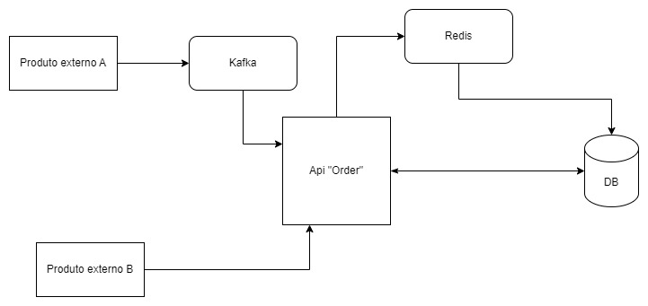

# **Teste_AmbevTech**
Serviço para receber, contabilizar pedidos e disponibilizar consultas de informações.

---

## **Considerações**

### **Kafka para Processamento de Pedidos**
Escolhi utilizar o **Kafka** para a entrada dos pedidos devido à sua escalabilidade eficiente e à confiabilidade no processamento de mensagens. O Kafka oferece uma excelente capacidade de lidar com volumes crescentes de dados e minimiza significativamente o risco de perda de mensagens, garantindo maior segurança e resiliência no sistema.

### **Redis como Cache**
Optei pelo **Redis** como camada de cache para reduzir a carga de consultas ao banco de dados. Sua capacidade de configurar o tempo de retenção do cache e de gerenciar automaticamente a exclusão de chaves menos utilizadas ajuda a otimizar o uso de memória e melhora a performance das consultas.

### **Banco de Dados Relacional**
Embora os bancos de dados relacionais não sejam tão fáceis de escalar, escolhi essa abordagem pela estruturação necessária ao modelo de dados e à consistência das transações. No entanto, considerando o volume de dados, é essencial planejar cuidadosamente índices, *views* e outras otimizações para garantir a performance em consultas mais complexas.

---

## **Possíveis Melhorias**

- **Fila Secundária para Erros:**  
  Implementar uma segunda fila para tratar casos de erro no processamento de pedidos. Essa fila permitiria a análise e o reprocessamento manual ou automático de mensagens problemáticas, evitando a perda de informações e garantindo maior confiabilidade no sistema.

---

## **Conclusão**

Este desenvolvimento foi estruturado de forma simples, com foco exclusivo no processamento de pedidos. No entanto, uma solução completa incluiria tabelas e funcionalidades adicionais, como:
- Dados do cliente.
- Informações de endereço.
- Controle de estoque.
- Integrações com sistemas externos.

Esses elementos seriam essenciais para atender às necessidades de um sistema robusto e escalável.

---

